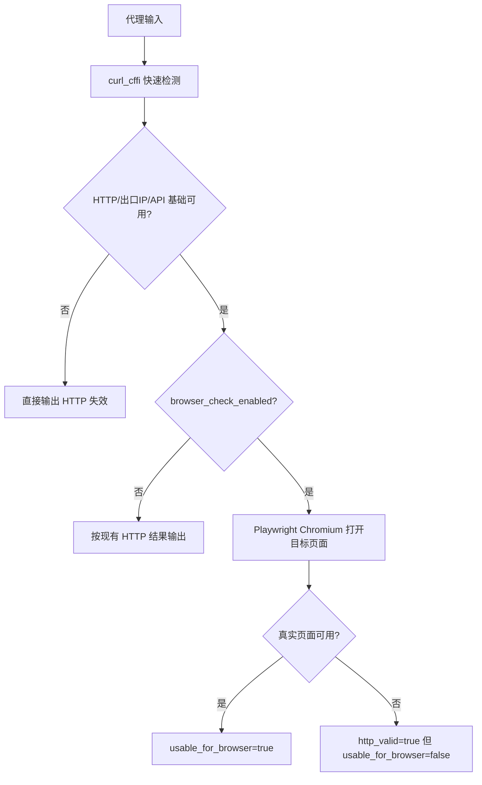

# Playwright 浏览器真实检测层设计

## 目标

在现有 `curl_cffi` 快速检测基础上，新增可选的 Playwright Chromium 真实浏览器检测层，解决“HTTP 检测通过但真实浏览器打不开目标页面”的误判。功能实现后应支持用 `https://dashboard.prem.io/auth/login` 作为浏览器目标 URL，并在手动检测时使用并发 10 验证完整链路。

## 核心决策

1. 使用 Playwright Python + Chromium，不再维护 nodriver 实现。
2. 保留当前 HTTP 快速检测作为第一阶段。
3. 启用浏览器检测后，只对 HTTP 初筛候选代理做 Playwright 二次检测。
4. 浏览器检测默认关闭，启用后严格模式默认开启。
5. 一个 Chromium Browser 进程复用多个隔离 BrowserContext；每条代理创建独立 context 并设置 context-level proxy。
6. 浏览器检测并发独立配置，避免和 HTTP 并发互相混淆。
7. 结果同时保留 HTTP 结论和浏览器结论：`http_valid`、`browser_checked`、`browser_ready`、`usable_for_browser`。
8. `/api/deep-check` 接口名保留，但内部切换为 Playwright 单条检测，降低前端兼容成本。
9. Docker、本地启动脚本、依赖、前端设置、README 同步更新。

## 两阶段检测流程



## 后端模块边界

### `proxy_check.py`

继续只负责 HTTP 快速检测、协议发现、出口 IP、API 域名、Cloudflare 静态特征检测和 HTTP 层评分。新增 `http_valid` 字段，语义等于浏览器检测介入前的 `valid`。

### `browser_check.py`

新增独立模块，职责：

- 定义 `BrowserCheckConfig`、`BrowserCheckResult`。
- 检测 Playwright 是否可用。
- 标准化代理字符串到 Playwright proxy 配置。
- 管理 Chromium 生命周期。
- 对每条代理创建独立 BrowserContext。
- 打开目标 URL，采集标题、最终 URL、主文档状态、body 长度、失败请求、异常响应、关键词命中和错误类型。
- 生成稳定 JSON 字段，可直接合并到代理结果中。

### `server.py`

负责配置读取、运行时设置、API、批量检测编排和结果合并：

- 初始化 `BrowserCheckConfig`。
- capabilities 返回 `playwright`、`browser_check`、`deep_check`。
- `/api/start` 接收浏览器检测配置或使用全局配置。
- `run_check()` 在 `check_many_async()` 的 result processor 中执行浏览器检测。
- 自动任务沿用全局浏览器配置。
- `/api/deep-check` 改为 Playwright 单条检测。

## 配置项

新增配置项及默认值：

```json
{
  "browser_check_enabled": false,
  "browser_check_timeout": 30,
  "browser_check_concurrent": 3,
  "browser_check_target_url": "",
  "browser_check_wait_until": "domcontentloaded",
  "browser_check_settle_ms": 3000,
  "browser_check_min_body_length": 100,
  "browser_check_success_text": [],
  "browser_check_fail_text": [
    "Just a moment",
    "Checking your browser",
    "Verify you are human",
    "Access denied",
    "cf-turnstile",
    "challenge-platform"
  ],
  "browser_check_screenshot_on_fail": false,
  "browser_check_strict": true,
  "browser_check_max_failed_requests": 10,
  "browser_check_max_bad_responses": 10
}
```

`browser_check_target_url` 为空时使用当前 target profile 的 `service_url`。用户可在设置页填入 `https://dashboard.prem.io/auth/login`。

## 代理协议规则

| 输入协议 | 浏览器层处理 |
|---|---|
| `http://` | 直接传给 Playwright |
| `https://` | 直接传给 Playwright |
| `socks5://` | 直接传给 Playwright |
| `socks5h://` | 转为 `socks5://`，记录 `dns_mode_adjusted` |
| `socks4://` | 浏览器层标记 `unsupported_protocol` |
| 无协议 | 依赖 HTTP 层协议发现后的 `result.proxy`，浏览器层不重新猜测 |

## 页面可用判定

### 成功条件

- 主文档状态码为 `200-399`。
- `page.goto()` 未抛出超时、代理、DNS、TLS 或导航异常。
- body 长度达到 `browser_check_min_body_length`。
- 未命中失败关键词。
- 未命中 Cloudflare/验证码/Access Denied 特征。
- 如果配置了成功关键词，至少命中一个。
- 失败请求数量不超过 `browser_check_max_failed_requests`。
- `>=400` 响应数量不超过 `browser_check_max_bad_responses`。

### 失败分类

- `unsupported_protocol`
- `proxy_connection_failed`
- `proxy_tunnel_failed`
- `timeout`
- `dns_failed`
- `tls_failed`
- `http_status_failed`
- `content_too_short`
- `success_text_missing`
- `fail_text_matched`
- `cf_challenge`
- `too_many_request_failures`
- `too_many_bad_responses`
- `navigation_failed`
- `playwright_unavailable`

## 结果字段

浏览器检测结果合并到每条代理结果：

```json
{
  "http_valid": true,
  "browser_checked": true,
  "browser_ready": true,
  "usable_for_browser": true,
  "browser_status": 200,
  "browser_title": "Prem Dashboard",
  "browser_final_url": "https://dashboard.prem.io/auth/login",
  "browser_latency": 3180,
  "browser_error": null,
  "browser_error_type": null,
  "browser_detail": {
    "target": "https://dashboard.prem.io/auth/login",
    "main_document_ok": true,
    "dom_loaded": true,
    "body_length": 2048,
    "success_text_matched": [],
    "fail_text_matched": [],
    "cf_challenge": false,
    "request_failed_count": 0,
    "bad_response_count": 0,
    "proxy_note": null
  }
}
```

未启用浏览器检测：

```json
{
  "http_valid": true,
  "browser_checked": false,
  "browser_ready": null,
  "usable_for_browser": true
}
```

启用严格模式时：

```text
valid = http_valid && browser_ready
usable_for_browser = browser_ready
```

非严格模式时：

```text
valid = http_valid
usable_for_browser = browser_ready == true
```

## 前端设计

设置弹窗新增：

- 启用 Playwright 浏览器真实检测。
- 浏览器检测目标 URL。
- 浏览器检测并发。
- 浏览器超时。
- 页面稳定等待毫秒。
- 最小 body 长度。
- 成功关键词，每行或逗号分隔。
- 失败关键词，每行或逗号分隔。
- 严格模式。
- 失败截图。

代理卡片新增标签：

- `浏览器可用`
- `浏览器不可用`
- `HTTP可用但浏览器失败`
- `浏览器未检测`

详情展示：标题、最终 URL、状态码、失败原因、失败请求数、异常响应数、关键词命中和截图路径。

## 依赖与部署

`requirements.txt` 增加：

```text
playwright>=1.0.0
```

本地启动脚本在安装依赖后运行：

```bash
python -m playwright install chromium
```

Dockerfile 移除 nodriver 与 patch，安装 Playwright Chromium：

```dockerfile
RUN python -m pip install -r requirements.txt \
    && python -m playwright install --with-deps chromium
```

## 验证要求

1. 单元测试覆盖代理配置转换、关键词判定、结果合并。
2. `python -m py_compile` 覆盖新增和改动 Python 文件。
3. 启动服务后 `/api/capabilities` 返回 Playwright 能力和浏览器设置。
4. 使用 `https://dashboard.prem.io/auth/login` 作为浏览器检测目标 URL。
5. 手动检测时提交 `max_concurrent=10`。
6. 使用至少一个本地可控 HTTP CONNECT 代理验证浏览器检测链路产生 `browser_checked=true` 结果。
